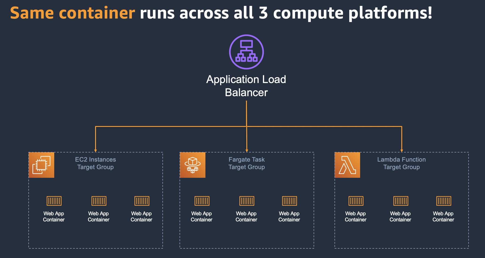

# AWS Lambda Adapter

Run web application containers on AWS Lambda, AWS Fargate and Amazon EC2 without changing code.



## How does it work?

AWS Lambda Adapter supports AWS Lambda function triggered by Amazon API Gateway Rest API, Http API(v2 event format), and Application Load Balancer.
Lambda Adapter converts incoming events to http requests and send to web application, and convert the http response back to lambda event response. 
When used outside of AWS Lambda execution environment, Lambda Adapter will just execute web application in the same process. 
This allows developers to package their web application as a container image and run it on AWS Lambda, AWS Fargate and Amazon EC2 without changing code.


## How to use it? 

AWS Lambda Adapter is written in Rust and based on [AWS Lambda Rust Runtime](https://github.com/awslabs/aws-lambda-rust-runtime). It is compiled as static linked binary. 
The binary is packaged as container image and published on AWS ECR Public Registry [here](https://gallery.ecr.aws/awsguru/lambda-adapter). 

To use it to build a docker image, just copy the bootstrap binary from lambda-adapter container to your container, and use it as ENTRYPOINT. 
Below is an example Dockerfile to package a nodejs application. 

```dockerfile
FROM public.ecr.aws/lambda/nodejs:14
COPY --from=public.ecr.aws/awsguru/lambda-adapter:latest /opt/bootstrap /opt/bootstrap
ENTRYPOINT ["/opt/bootstrap"]
EXPOSE 8080
WORKDIR "/var/task"
ADD extensions/ /opt
ADD src/package.json /var/task/package.json
ADD src/package-lock.json /var/task/package-lock.json
RUN npm install --production
ADD src/ /var/task
CMD ["node", "index.js"]
```
Lambda Adapter will run CMD to start nodejs application, and perform readiness check on http://localhost:8080/ every 10ms. 
It will start lambda runtime after receiving 200 response code from the application and forward requests to http://localhost:8080. 

The readiness check port/path and traffic port can be configured using environment variables. 

|Environment Variable|Description          |Default|
|--------------------|---------------------|-------|
|READINESS_CHECK_PORT|readiness check port | 8080  |
|READINESS_CHECK_PATH|readiness check path | /     |
|PORT                |traffic port         | 8080  |

## Show me some examples

3 examples are included under the 'examples' directory. Check them out, find out how easy it is to run a web application on AWS Lambda. 

- [nginx](examples/nginx)
- [express.js](examples/expressjs)
- [SpringBoot](examples/springboot)


## Similar projects 

This project took inspiration from several community projects. 

- [re:Web](https://github.com/apparentorder/reweb)
- [Serverlessish](https://github.com/glassechidna/serverlessish)

