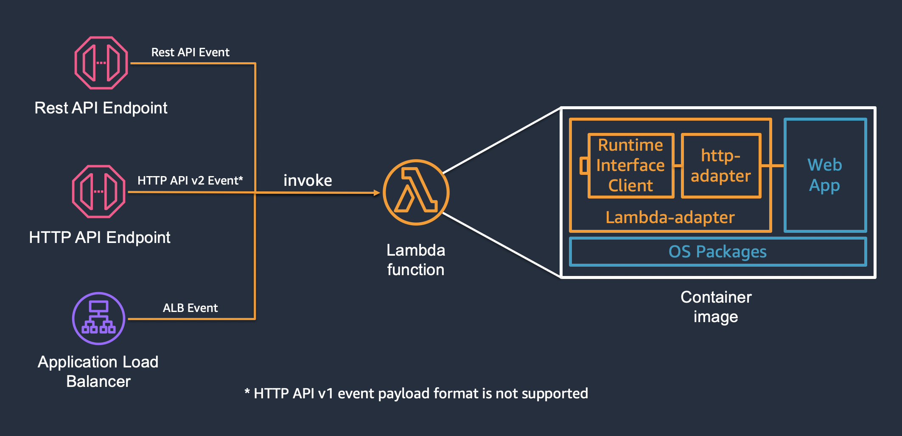

# AWS Lambda Web Adapter

A tool to run web applications on AWS Lambda

AWS Lambda Web Adapter allows developers to build web apps (http api) with familiar frameworks (e.g. Express.js, Next.js, Flask, SpringBoot, and Laravel, anything speaks HTTP 1.1/1.0) and run it on AWS Lambda.
The same docker image can run on AWS Lambda, Amazon EC2, AWS Fargate, and local computers.



## Features

- Run web applications on AWS Lambda
- Supports Amazon API Gateway Rest API and Http API endpoints, Lambda Function URLs, and Application Load Balancer
- Supports Lambda managed runtimes, custom runtimes and docker OCI images
- Supports any web frameworks and languages, no new code dependency to include
- Automatic encode binary response
- Enables graceful shutdown
- Supports response payload compression
- Supports web applications running over both HTTP and HTTPS

## Usage

AWS Lambda Web Adapter work with Lambda functions packaged as both docker images and Zip packages.

### Lambda functions packaged as Docker Images or OCI Images

To use Lambda Web Adapter with docker images, package your web app (http api) in a Dockerfile, and add one line to copy Lambda Web Adapter binary to /opt/extensions inside your container.
By default, Lambda Web Adapter assumes the web app is listening on port 8080. If not, you can specify the port via [configuration](#Configurations).

```dockerfile
COPY --from=public.ecr.aws/awsguru/aws-lambda-adapter:0.6.4 /lambda-adapter /opt/extensions/lambda-adapter
```

Pre-compiled Lambda Web Adapter binaries are provided in ECR public repo: [public.ecr.aws/awsguru/aws-lambda-adapter](https://gallery.ecr.aws/awsguru/aws-lambda-adapter).
Multi-arch images are also provided in this repo. It works on both x86_64 and arm64 CPU architecture.

Below is a Dockerfile for [an example nodejs application](examples/expressjs).

```dockerfile
FROM public.ecr.aws/docker/library/node:16.13.2-stretch-slim
COPY --from=public.ecr.aws/awsguru/aws-lambda-adapter:0.6.4 /lambda-adapter /opt/extensions/lambda-adapter
ENV PORT=7000
WORKDIR "/var/task"
ADD src/package.json /var/task/package.json
ADD src/package-lock.json /var/task/package-lock.json
RUN npm install --omit=dev
ADD src/ /var/task
CMD ["node", "index.js"]
```

This works with any base images except AWS managed base images. To use AWS managed base images, you need to override the ENTRYPOINT to start your web app.

### Lambda functions packaged as Zip package for AWS managed runtimes

AWS Lambda Web Adapter also works with AWS managed Lambda runtimes. You need to do three things:

1. attach Lambda Web Adapter layer to your function.
   1. x86_64: `arn:aws:lambda:${AWS::Region}:753240598075:layer:LambdaAdapterLayerX86:15`
   2. arm64: `arn:aws:lambda:${AWS::Region}:753240598075:layer:LambdaAdapterLayerArm64:15`
2. configure Lambda environment variable `AWS_LAMBDA_EXEC_WRAPPER` to `/opt/bootstrap`.
3. set function handler to your web application start up script. e.g. `run.sh`.

For details, please check out [the example nodejs application](examples/expressjs-zip).

## Readiness Check

When a new Lambda Execution Environment starts up, Lambda Web Adapter will boot up as a Lambda Extension, followed by the web application. 

By default, Lambda Web Adapter will send HTTP GET requests to the web application at `http://127.0.0.1:8080/`. The port and path can be customized with two environment variables: `READINESS_CHECK_PORT` and `READINESS_CHECK_PATH`.  

Lambda Web Adapter will retry this request every 10 milliseconds until the web application returns an HTTP response (**status code >= 100 and < 500**) or the function times out. 

In addition, you can configure the adapter to preform readiness check with TCP connect, by setting `READINESS_CHECK_PROTOCOL` to `tcp`. 

After passing readiness check, Lambda Web Adapter will start Lambda Runtime and forward the invokes to the web application. 

## Configurations

The readiness check port/path and traffic port can be configured using environment variables. These environment variables can be defined either within docker file or as Lambda function configuration.

| Environment Variable                                         | Description                                                                          | Default     |
|--------------------------------------------------------------|--------------------------------------------------------------------------------------|-------------|
| AWS_LWA_PORT / PORT*                                         | traffic port                                                                         | "8080"      |
| AWS_LWA_READINESS_CHECK_PORT / READINESS_CHECK_PORT*         | readiness check port, default to the traffic port                                    | PORT        |
| AWS_LWA_READINESS_CHECK_PATH / READINESS_CHECK_PATH*         | readiness check path                                                                 | "/"         |
| AWS_LWA_READINESS_CHECK_PROTOCOL / READINESS_CHECK_PROTOCOL* | readiness check protocol: "http" or "tcp", default is "http"                         | "http"      |
| AWS_LWA_ASYNC_INIT / ASYNC_INIT*                             | enable asynchronous initialization for long initialization functions                 | "false"     |
| AWS_LWA_REMOVE_BASE_PATH / REMOVE_BASE_PATH*                 | the base path to be removed from request path                                        | None        |
| AWS_LWA_ENABLE_COMPRESSION                                   | enable gzip compression for response body                                            | "false"     |
| AWS_LWA_ENABLE_TLS                                           | enable TLS/HTTPS support for the web application                                     | "false"     |
| AWS_LWA_TLS_SERVER_NAME                                      | override server name for TLS SNI                                                     | "localhost" |
| AWS_LWA_TLS_CERT_FILE                                        | override server certificate file                                                     | None        |
| AWS_LWA_INVOKE_MODE                                          | Lambda function invoke mode: "buffered" or "response_stream", default is "buffered"  | "buffered"  |

> **Note:**
> We use "AWS_LWA_" prefix to namespacing all environment variables used by Lambda Web Adapter. The original ones will be supported until we reach version 1.0. 

**AWS_LWA_PORT / PORT** - Lambda Web Adapter will send traffic to this port. This is the port your web application listening on. Inside Lambda execution environment, 
the web application runs as a non-root user, and not allowed to listen on ports lower than 1024. Please also avoid port 9001 and 3000. 
Lambda Runtime API is on port 9001. CloudWatch Lambda Insight extension uses port 3000.  

**AWS_LWA_ASYNC_INIT / ASYNC_INIT** - Lambda managed runtimes offer up to 10 seconds for function initialization. During this period of time, Lambda functions have burst of CPU to accelerate initialization, and it is free. 
If a lambda function couldn't complete the initialization within 10 seconds, Lambda will restart the function, and bill for the initialization. 
To help functions to use this 10 seconds free initialization time and avoid the restart, Lambda Web Adapter supports asynchronous initialization. 
When this feature is enabled, Lambda Web Adapter performs readiness check up to 9.8 seconds. If the web app is not ready by then, 
Lambda Web Adapter signals to Lambda service that the init is completed, and continues readiness check in the handler. 
This feature is disabled by default. Enable it by setting environment variable `ASYNC_INIT` to `true`. 

**AWS_LWA_REMOVE_BASE_PATH / REMOVE_BASE_PATH** - The value of this environment variable tells the adapter whether the application is running under a base path.
For example, you could have configured your API Gateway to have a /orders/{proxy+} and a /catalog/{proxy+} resource.
Each resource is handled by a separate Lambda functions. For this reason, the application inside Lambda may not be aware of the fact that the /orders path exists.
Use REMOVE_BASE_PATH to remove the /orders prefix when routing requests to the application. Defaults to empty string. Checkout [SpringBoot](examples/springboot) example.

**AWS_LWA_ENABLE_COMPRESSION** - Lambda Web Adapter supports gzip compression for response body. This feature is disabled by default. Enable it by setting environment variable `AWS_LWA_ENABLE_COMPRESSION` to `true`.
When enabled, this will compress responses unless it's an image as determined by the content-type starting with `image` or the response is less than 32 bytes. This will also compress HTTP/1.1 chunked streaming response.

**AWS_LWA_ENABLE_TLS** - With TLS support enabled, Lambda Web Adapter uses HTTPS to communicate with the web application. Lambda Web Adapter use
[hyper-rustls](https://crates.io/crates/hyper-rustls) with [rustls-native-certs](https://crates.io/crates/rustls-native-certs) to implement TLS support. 
It supports TLS1.2 and TLS1.3 with safe defaults. To see the supported TLS features, please check out [rustls](https://docs.rs/rustls/latest/rustls/). 

**AWS_LWA_TLS_SERVER_NAME** - allows you to override the server name for TLS Server Name Indication. This should match one of the SAN names on the server certificate. The default is "localhost".

**AWS_LWA_TLS_CERT_FILE** - Lambda Web Adapter uses the platform's native certificate store to find trusted certificates. You can configure this environment variable to use your own certificate.
Please check out [FastAPI with HTTPS](examples/fastapi-https/) example for more details.

**AWS_LWA_INVOKE_MODE** - Lambda function invoke mode. The default is "buffered". When configured as "response_stream", Lambda Web Adapter will stream response to Lambda service [blog](https://aws.amazon.com/blogs/compute/introducing-aws-lambda-response-streaming/). 
Please check out [FastAPI with Response Streaming](examples/fastapi-response-streaming/) example. 

## Request Context

**Request Context** is metadata API Gateway sends to Lambda for a request. It usually contains requestId, requestTime, apiId, identity, and authorizer. Identity and authorizer are useful to get client identity for authorization. API Gateway Developer Guide contains more details [here](https://docs.aws.amazon.com/apigateway/latest/developerguide/set-up-lambda-proxy-integrations.html#api-gateway-simple-proxy-for-lambda-input-format).  

Lambda Web Adapter forwards this information to the web application in a Http Header named "x-amzn-request-context". In the web application, you can retrieve the value of this http header and deserialize it into a JSON object. Check out [Express.js in Zip](examples/expressjs-zip) on how to use it.

## Graceful Shutdown

For a function with Lambda Extensions registered, Lambda enables shutdown phase for the function. When Lambda service is about to shut down a Lambda execution environment, 
it sends a SIGTERM signal to the runtime and then a SHUTDOWN event to each registered external extensions. Developers could catch the SIGTERM signal in the lambda functions and perform graceful shutdown tasks.
More details in [this repo](https://github.com/aws-samples/graceful-shutdown-with-aws-lambda).

## Local Debugging

Lambda Web Adapter allows developers to develop web applications locally with familiar tools and debuggers: just run the web app locally and test it. If you want to simulate Lambda Runtime environment locally, you can use AWS SAM CLI. The following command starts a local api gateway endpoint and simulate the Lambda runtime execution environment.  

```bash
sam local start-api
```

Please note that `sam local` starts a Lambda Runtime Interface Emulator on port 8080. So your web application should avoid port `8080` if you plan to use `sam local`. 

## Examples

- [FastAPI](examples/fastapi/)
- [FastAPI with HTTPS](examples/fastapi-https/)
- [FastAPI with Response Streaming](examples/fastapi-response-streaming/)
- [FastAPI in Zip](examples/fastapi-zip/)
- [Flask](examples/flask)
- [Flask in Zip](examples/flask-zip)
- [Serverless Django by @efi-mk](https://github.com/aws-hebrew-book/serverless-django)
- [Express.js](examples/expressjs)
- [Express.js in Zip](examples/expressjs-zip)
- [Next.js](examples/nextjs)
- [Next.js in Zip](examples/nextjs-zip)
- [SpringBoot](examples/springboot)
- [SpringBoot in Zip](examples/springboot-zip)
- [Nginx](examples/nginx)
- [PHP](examples/php)
- [Rust Actix Web in Zip](examples/rust-actix-web-zip)
- [Rust Axum in Zip](examples/rust-axum-zip)
- [Golang Gin](examples/gin)
- [Golang Gin in Zip](examples/gin-zip)
- [Deno Oak in Zip](examples/deno-zip)

## Acknowledgement

This project was inspired by several community projects.

- [re:Web](https://github.com/apparentorder/reweb)
- [Serverlessish](https://github.com/glassechidna/serverlessish)

## Similar Projects

Several projects also provide similar capabilities as language specific packages/frameworks. 

- [Serverless Java Container](https://github.com/awslabs/aws-serverless-java-container)
- [Serverless Express](https://github.com/vendia/serverless-express)
- [Serverless Python - Zappa](https://github.com/zappa/Zappa)
- [Serverless Rails - Lamby](https://github.com/customink/lamby) 
- [Serverless PHP - Bref](https://github.com/brefphp/bref) 

## Security

See [CONTRIBUTING](CONTRIBUTING.md#security-issue-notifications) for more information.

## License

This project is licensed under the Apache-2.0 License.
