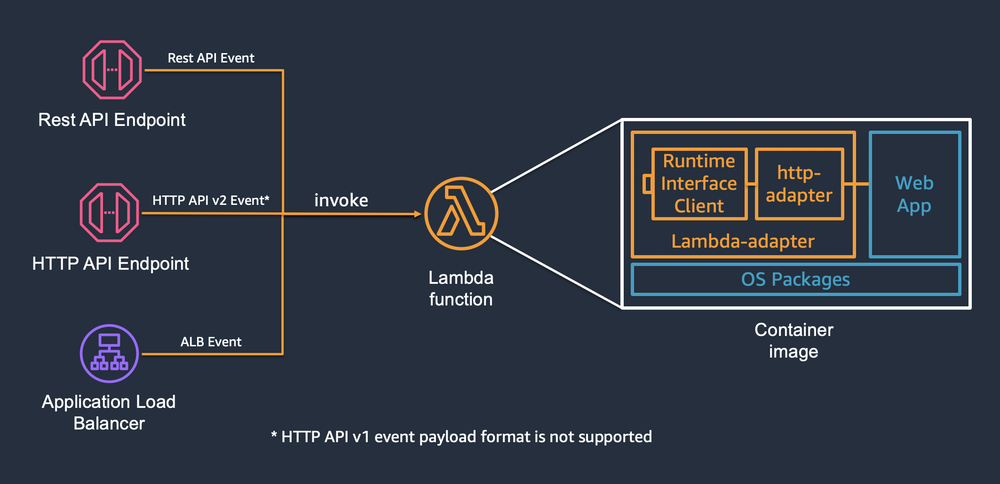

# AWS Lambda Web Adapter

A tool to run web applications on AWS Lambda

AWS Lambda Web Adapter allows developers to build web apps (http api) with familiar frameworks (e.g. Express.js, Next.js, Flask, SpringBoot, ASP.NET and Laravel, anything speaks HTTP 1.1/1.0) and run it on AWS Lambda.
The same docker image can run on AWS Lambda, Amazon EC2, AWS Fargate, and local computers.



📖 **[Read the full User Guide](https://aws.github.io/aws-lambda-web-adapter/)**

## Features

- Run web applications on AWS Lambda
- Supports Amazon API Gateway Rest API and Http API endpoints, Lambda Function URLs, and Application Load Balancer
- Supports Lambda managed runtimes, custom runtimes and docker OCI images
- Supports Lambda Managed Instances for multi-concurrent request handling
- Supports Lambda SnapStart with before-checkpoint and after-restore hooks
- Supports any web frameworks and languages, no new code dependency to include
- Automatic encode binary response
- Enables graceful shutdown
- Supports response payload compression
- Supports response streaming
- Supports multi-tenancy via tenant ID propagation
- Supports non-http event triggers

## Quick Start

### Docker Images

Add one line to your Dockerfile:

```dockerfile
COPY --from=public.ecr.aws/awsguru/aws-lambda-adapter:1.0.1 /lambda-adapter /opt/extensions/lambda-adapter
```

Pre-compiled multi-arch images (x86_64 and arm64) are available at [public.ecr.aws/awsguru/aws-lambda-adapter](https://gallery.ecr.aws/awsguru/aws-lambda-adapter). [Non-AWS base images](https://docs.aws.amazon.com/lambda/latest/dg/images-create.html) may be used since the [Runtime Interface Client](https://docs.aws.amazon.com/lambda/latest/dg/images-create.html#images-ric) ships with the Lambda Web Adapter.

👉 [Docker Images guide](https://aws.github.io/aws-lambda-web-adapter/getting-started/docker-images.html)

### Zip Packages

1. Attach the Lambda Web Adapter layer to your function:
   - x86_64: `arn:aws:lambda:${AWS::Region}:753240598075:layer:LambdaAdapterLayerX86:28`
   - arm64: `arn:aws:lambda:${AWS::Region}:753240598075:layer:LambdaAdapterLayerArm64:28`
2. Set environment variable `AWS_LAMBDA_EXEC_WRAPPER` to `/opt/bootstrap`
3. Set function handler to your startup script, e.g. `run.sh`

👉 [Zip Packages guide](https://aws.github.io/aws-lambda-web-adapter/getting-started/zip-packages.html) (includes AWS China region ARNs and Windows caveats)

## Configurations

The readiness check port/path and traffic port can be configured using environment variables. These environment variables can be defined either within docker file or as Lambda function configuration.

| Environment Variable                    | Description                                                                     | Default      |
|-----------------------------------------|---------------------------------------------------------------------------------|--------------|
| AWS_LWA_PORT                            | traffic port (falls back to `PORT`)                                             | "8080"       |
| AWS_LWA_READINESS_CHECK_PORT            | readiness check port                                                            | AWS_LWA_PORT |
| AWS_LWA_READINESS_CHECK_PATH            | readiness check path                                                            | "/"          |
| AWS_LWA_READINESS_CHECK_PROTOCOL        | readiness check protocol: "http" or "tcp"                                       | "http"       |
| AWS_LWA_READINESS_CHECK_HEALTHY_STATUS  | HTTP status codes considered healthy (e.g., "200-399")                          | "100-499"    |
| AWS_LWA_ASYNC_INIT                      | enable asynchronous initialization for long initialization functions             | "false"      |
| AWS_LWA_REMOVE_BASE_PATH               | base path to remove from the request path; strips exactly one leading occurrence on a segment boundary (with `/api`: `/api/api/order`->`/api/order`, `/apiorder` unchanged; trailing slash normalized) | None         |
| AWS_LWA_ENABLE_COMPRESSION             | enable gzip/br compression for response body (buffered mode only)               | "false"      |
| AWS_LWA_INVOKE_MODE                    | Lambda function invoke mode: "buffered" or "response_stream"                    | "buffered"   |
| AWS_LWA_PASS_THROUGH_PATH             | the path for receiving event payloads from non-http triggers                    | "/events"    |
| AWS_LWA_AUTHORIZATION_SOURCE          | a header name to be replaced to `Authorization`                                 | None         |
| AWS_LWA_ERROR_STATUS_CODES            | HTTP status codes that will cause Lambda invocations to fail (e.g. "500,502-504") | None       |
| AWS_LWA_LAMBDA_RUNTIME_API_PROXY      | overwrites `AWS_LAMBDA_RUNTIME_API` to allow proxying request                   | None         |
| AWS_LWA_SNAPSTART_BEFORE_CHECKPOINT_PATH | inner-app path the adapter POSTs to before a SnapStart snapshot (drain resources) | None         |
| AWS_LWA_SNAPSTART_AFTER_RESTORE_PATH     | inner-app path the adapter POSTs to after a SnapStart restore (reconnect/reseed)  | None         |
| AWS_LWA_POOL_IDLE_TIMEOUT_SECONDS        | idle keep-alive (seconds) for the adapter's connection to your app                | "4"          |
| AWS_LWA_READINESS_CHECK_TIMEOUT_SECONDS  | seconds (fractional allowed, e.g. 0.5) to wait for the app to report ready (cold-start init and after a SnapStart restore); on expiry the adapter FAILS (init fails and the runtime never starts; a restore fails) rather than serving. Unset, 0, or negative all mean wait indefinitely (a set-but-<=0 or malformed value is ignored with a warning). async_init keeps its own ~9.8s bound | unset / <=0 (unbounded) |

> **Deprecation Notice:** The following non-namespaced environment variables are deprecated and will be removed in version 2.0:
> `HOST`, `READINESS_CHECK_PORT`, `READINESS_CHECK_PATH`, `READINESS_CHECK_PROTOCOL`, `REMOVE_BASE_PATH`, `ASYNC_INIT`.
> Please migrate to the `AWS_LWA_` prefixed versions. Note: `PORT` is not deprecated and remains a supported fallback for `AWS_LWA_PORT`.
>
> Additionally, `AWS_LWA_READINESS_CHECK_MIN_UNHEALTHY_STATUS` has been removed in 1.0. Use `AWS_LWA_READINESS_CHECK_HEALTHY_STATUS` instead.

👉 [Detailed configuration docs](https://aws.github.io/aws-lambda-web-adapter/configuration/environment-variables.html)

### SnapStart support

When your function uses [Lambda SnapStart](https://docs.aws.amazon.com/lambda/latest/dg/snapstart.html),
the adapter can notify your web application at the snapshot boundary so it can
drain and re-establish state (database connections, cached DNS, PRNG seeds,
unique identifiers). Both hooks are opt-in and independent.

| Variable | When the adapter calls it | Use it to |
|---|---|---|
| `AWS_LWA_SNAPSTART_BEFORE_CHECKPOINT_PATH` | Before the snapshot is taken | Drain/close resources that won't survive the snapshot |
| `AWS_LWA_SNAPSTART_AFTER_RESTORE_PATH`     | After restore, before serving traffic | Reconnect, refresh credentials, reseed randomness, regenerate unique IDs |

Each hook is an empty `POST`; your application must respond with a `2xx` status.
A non-`2xx` response or a connection failure fails the SnapStart phase
(initialization for the before-checkpoint hook, restore for the after-restore hook)
instead of serving traffic against an improperly prepared application. The adapter
does not impose its own deadline on a hook — Lambda bounds both phases, and the
after-restore hook in particular must finish within your function timeout.

After restore, the adapter also automatically refreshes its own HTTP connection
to your application, so it never reuses a connection captured in the snapshot, and
then re-runs the readiness check before admitting traffic. By default this wait is
unbounded; set `AWS_LWA_READINESS_CHECK_TIMEOUT_SECONDS` (fractional seconds allowed)
to bound it, in which case a restore whose application does not report ready within
that timeout fails.

> These hook paths are control-plane operations. External requests (via API
> Gateway or ALB) that target a configured hook path receive `403 Forbidden` and
> are never forwarded to your application, so choose paths your normal traffic
> does not use.
>
> **Warning:** that guard exists only while the adapter is in the request path —
> that is, when your application runs on Lambda behind the adapter. The hook routes
> are ordinary application routes that mutate state, so if you run the same image
> or application **without** the adapter (Amazon ECS, Amazon EKS, a local Docker
> host), they are reachable and unauthenticated. Don't expose them publicly in
> those deployments, or protect them yourself.

See the [FastAPI with SnapStart example](examples/fastapi-snapstart-zip) for a complete, deployable application.

## Examples

- [FastAPI](examples/fastapi)
- [FastAPI in Zip](examples/fastapi-zip)
- [FastAPI with Background Tasks](examples/fastapi-background-tasks)
- [FastAPI with Response Streaming](examples/fastapi-response-streaming)
- [FastAPI with Response Streaming in Zip](examples/fastapi-response-streaming-zip)
- [FastAPI with Response Streaming on Lambda Managed Instances](examples/fastapi-response-streaming-lmi)
- [FastAPI Response Streaming Backend with IAM Auth](examples/fastapi-backend-only-response-streaming/)
- [FastAPI with SnapStart](examples/fastapi-snapstart)
- [FastAPI with SnapStart in Zip](examples/fastapi-snapstart-zip)
- [Flask](examples/flask)
- [Flask in Zip](examples/flask-zip)
- [Serverless Django](https://github.com/aws-hebrew-book/serverless-django)  by [@efi-mk](https://github.com/efi-mk)
- [Express.js](examples/expressjs)
- [Express.js in Zip](examples/expressjs-zip)
- [Next.js](examples/nextjs)
- [Next.js in Zip](examples/nextjs-zip)
- [Next.js Response Streaming](examples/nextjs-response-streaming)
- [SpringBoot](examples/springboot)
- [SpringBoot in Zip](examples/springboot-zip)
- [SpringBoot Response Streaming](examples/springboot-response-streaming-zip)
- [Nginx](examples/nginx)
- [Rust Actix Web in Zip](examples/rust-actix-web-zip)
- [Rust Axum in Zip](examples/rust-axum-zip)
- [Golang Gin](examples/gin)
- [Golang Gin in Zip](examples/gin-zip)
- [Deno Oak in Zip](examples/deno-zip)
- [Laravel on Lambda](https://github.com/aws-samples/lambda-laravel)
- [ASP.NET MVC](examples/aspnet-mvc)
- [ASP.NET MVC in Zip](examples/aspnet-mvc-zip)
- [ASP.NET Web API in Zip](examples/aspnet-webapi-zip)
- [SQS Express.js](examples/sqs-expressjs)
- [Bedrock Agent FastAPI](examples/bedrock-agent-fastapi)
- [Bedrock Agent FastAPI in Zip](examples/bedrock-agent-fastapi-zip)
- [FastHTML](examples/fasthtml)
- [FastHTML in Zip](examples/fasthtml-zip)
- [FastHTML with Response Streaming](examples/fasthtml-response-streaming)
- [FastHTML with Response Streaming in Zip](examples/fasthtml-response-streaming-zip)
- [Remix](examples/remix/)
- [Remix in Zip](examples/remix-zip/)
- [Sveltekit SSR Zip](examples/sveltekit-ssr-zip/)
- [Datadog](examples/datadog)
- [Datadog in Zip](examples/datadog-zip)

👉 [Examples organized by language](https://aws.github.io/aws-lambda-web-adapter/examples/overview.html)

## Acknowledgement

This project was inspired by several community projects.

- [re:Web](https://github.com/apparentorder/reweb)
- [Serverlessish](https://github.com/glassechidna/serverlessish)

## Migrating from 0.x to 1.0

### Environment Variables

All environment variables now use the `AWS_LWA_` prefix. The old non-prefixed names still work but are deprecated and will be removed in version 2.0.

| Old (Deprecated)             | New                                        |
|------------------------------|--------------------------------------------|
| `READINESS_CHECK_PORT`       | `AWS_LWA_READINESS_CHECK_PORT`             |
| `READINESS_CHECK_PATH`       | `AWS_LWA_READINESS_CHECK_PATH`             |
| `READINESS_CHECK_PROTOCOL`   | `AWS_LWA_READINESS_CHECK_PROTOCOL`         |
| `REMOVE_BASE_PATH`           | `AWS_LWA_REMOVE_BASE_PATH`                 |
| `ASYNC_INIT`                 | `AWS_LWA_ASYNC_INIT`                       |

> **Note:** `PORT` is **not** deprecated and remains a supported fallback for `AWS_LWA_PORT`.

### Readiness Check Health Status

`AWS_LWA_READINESS_CHECK_MIN_UNHEALTHY_STATUS` has been removed. Use `AWS_LWA_READINESS_CHECK_HEALTHY_STATUS` instead, which accepts comma-separated codes and ranges:

```bash
# Old
AWS_LWA_READINESS_CHECK_MIN_UNHEALTHY_STATUS=400

# New (equivalent)
AWS_LWA_READINESS_CHECK_HEALTHY_STATUS=100-399
```

## Similar Projects

Several projects also provide similar capabilities as language specific packages/frameworks.

- [Serverless Java Container](https://github.com/aws/serverless-java-container)
- [Serverless Express](https://github.com/vendia/serverless-express)
- [Serverless Python - Zappa](https://github.com/zappa/Zappa)
- [Serverless Rails - Lamby](https://github.com/customink/lamby)
- [Serverless PHP - Bref](https://github.com/brefphp/bref)

## Security

See [SECURITY](SECURITY.md) for vulnerability reporting and [CONTRIBUTING](CONTRIBUTING.md) for more information.

## License

This project is licensed under the Apache-2.0 License.
