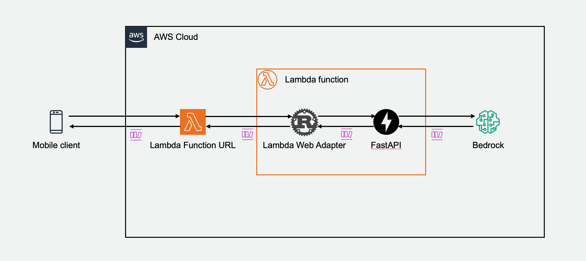
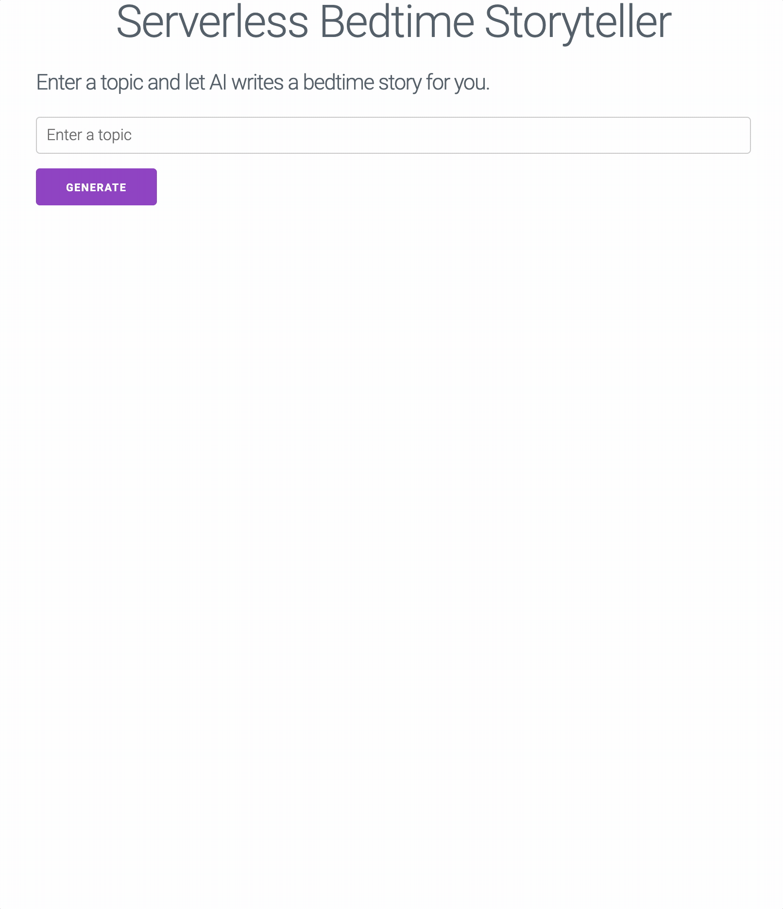

# Serverless Bedtime Storyteller

This example shows streaming response from Amazon Bedrock with FastAPI on AWS Lambda.





## How does it work?

This example use Anthropic Claude v2 model to generate bedtime stories. FastAPI provides the static web frontend and the inference API. In FastAPI inference API endpoint, it invokes Bedrock using Boto3, and stream the response. Both Lambda Web Adapter and function URL have response streaming model enabled. So the response chunks from Bedrock are streamed all the way back to the client. 

This function is packaged as a Docker image. Here is the content of the Dockerfile. 

```dockerfile
FROM public.ecr.aws/docker/library/python:3.12.0-slim-bullseye
COPY --from=public.ecr.aws/awsguru/aws-lambda-adapter:0.7.1 /lambda-adapter /opt/extensions/lambda-adapter

WORKDIR /app
ADD . .
RUN pip install -r requirements.txt

CMD ["python", "main.py"]
```

Notice that we only need to add the second line to install Lambda Web Adapter. 

```dockerfile
COPY --from=public.ecr.aws/awsguru/aws-lambda-adapter:0.7.1 /lambda-adapter /opt/extensions/
```

In the SAM template, we use an environment variable `AWS_LWA_INVOKE_MODE: RESPONSE_STREAM` to configure Lambda Web Adapter in response streaming mode. And adding a function url with `InvokeMode: RESPONSE_STREAM`. 

```yaml
Resources:
  FastAPIFunction:
    Type: AWS::Serverless::Function
    Properties:
      PackageType: Image
      MemorySize: 512
      Environment:
        Variables:
          AWS_LWA_INVOKE_MODE: RESPONSE_STREAM
      FunctionUrlConfig:
        AuthType: NONE
        InvokeMode: RESPONSE_STREAM
      Policies:
      - Statement:
        - Sid: BedrockInvokePolicy
          Effect: Allow
          Action:
          - bedrock:InvokeModelWithResponseStream
          Resource: '*'
      Tracing: Active
    Metadata:
      Dockerfile: Dockerfile
      DockerContext: ./app
      DockerTag: v1
```      


## Build and deploy

Run the following commends to build and deploy this example. 

```bash
sam build --use-container
sam deploy --guide
```


## Test the example

After the deployment completes, open the `FastAPIFunctionUrl` in the output messages. You should see a simple web page. Here is a demo. 


